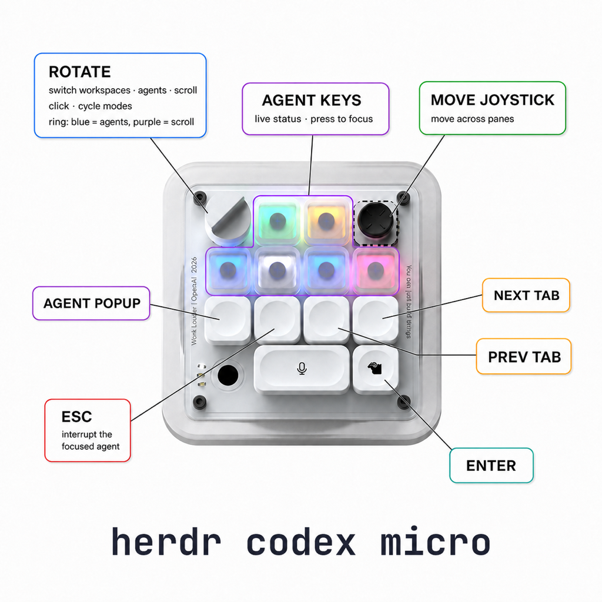

# codex-micro

<p align="center">
  
</p>

Use your Work Louder Codex Micro (OpenAI edition) natively with [Herdr](https://herdr.dev):

- The six Agent Keys light up with live agent statuses and focus their agent on press.
- The dial, joystick, and command keys control Herdr: workspaces, panes, tabs, and more.

> **How it works**: Work Louder's Input app does not let you configure the
> device's first layer, it is reserved for the Codex integration, so the
> plugin talks to the device directly, doing what the ChatGPT desktop app
> does but for Herdr. The per-key status lights only exist on that first
> layer, and the device serves one host at a time, so this works while the
> ChatGPT app is closed; while it runs, the plugin yields the device
> automatically and reclaims it when the app quits.

**Requirements**: macOS ≥ 14, Herdr ≥ 0.7.5, Node ≥ 22.

## Install

```bash
herdr plugin install alasano/house-of-herdr/packages/codex-micro
```

The daemon starts with every Herdr session from then on.

### Local development

```bash
pnpm install && pnpm build
herdr plugin link packages/codex-micro
```

## Permissions

macOS requires manual grants in **System Settings → Privacy & Security**:

- **Input Monitoring**, required: grant it to the app you run Herdr in
  (Ghostty, kitty, iTerm, ...).
- **Accessibility**, for global `{"key": ...}` bindings and dial scrolling.
  Herdr-side bindings do not need it.

Verify everything with `node dist/doctor.js` from the plugin directory; it
names exactly what is missing. If the daemon logs `privilege violation`
after an automatic start, launch it once from your terminal
(`node dist/start.js`).

## Controls (defaults)

| Control        | Action                                                    |
| -------------- | --------------------------------------------------------- |
| Agent Keys 1-6 | Focus the assigned Herdr agent and raise the terminal     |
| Joystick       | Move pane focus; circle the stick to keep moving          |
| Dial rotate    | Cycle workspaces or agents; scroll in scroll mode         |
| Dial click     | Cycle through the configured dial modes                   |
| ACT06          | Toggle the key-map popup                                  |
| ACT07          | Send Escape to Herdr's focused pane (interrupt the agent) |
| ACT08 / ACT09  | Previous / next tab                                       |
| ACT10          | Mic bar; unbound, bind your dictation hotkey              |
| ACT12          | Send Enter to Herdr's focused pane (submit), not globally |

Every control except the six Agent Keys is remappable through the config:
ask your agent to read [CONFIGURING.md](CONFIGURING.md) to customize keys or
create a configuration for any mapping you want. Config edits apply
instantly, no restart.

The default order is workspaces, agents, then scroll; set `dial_mode_order` to
change both the startup mode and click order. The ring is off in workspace
mode, blue in agent mode, and purple in scroll mode. In scroll mode, turn
counter-clockwise to scroll up and clockwise to scroll down. When
Ghostty/Herdr is frontmost it targets Herdr's keyboard-focused pane regardless
of its initial pointer position; Ghostty requires moving the pointer to that
pane before it will route the wheel gesture there. In other apps it scrolls
beneath the pointer like a normal wheel. Set `scroll_steps` from 1 to 12 in the
plugin config to tune how much each detent moves; changes apply live. See
[CONFIGURING.md](CONFIGURING.md) for details. With scroll work still buffered,
the first reverse detent acts as a brake: it cancels the old direction and
briefly ignores new ticks before scrolling back.

Bindings come in two flavors. **Herdr-side** bindings (the presets plus
`herdr-key` / `herdr-text`) go through Herdr's API to the focused pane and
need no macOS permissions. **Global** bindings (`key`) press a real key in
whatever app is frontmost and require the Accessibility permission. For
example, a dictation hotkey on the mic bar, and swapping the CODEX key from
the default Herdr-side Enter to a global one that submits in any app:

```json
{
  "bindings": {
    "ACT10": { "key": "option" },
    "ACT12": { "key": "return" }
  }
}
```

Bare modifier names press the left key; `lopt`/`ropt` and friends pick a
side. See [CONFIGURING.md](CONFIGURING.md) for wiring the mic bar to a
dictation tool.

The physical input names:

<p align="center">
  
</p>

## Lighting

Color carries the agent's status; the breathing effect marks the one agent
Herdr currently has focused, so a glance finds where you are among six lit
keys.

| Status        | Light        |
| ------------- | ------------ |
| blocked       | amber, solid |
| done (unseen) | green, solid |
| working       | blue, solid  |
| idle          | white, dim   |
| unknown       | white, faint |
| empty slot    | off          |
| _focused_     | _breathing_  |

The focused agent keeps its status color and breathes at full brightness,
whatever that status is. Nothing breathes while Herdr's focused pane holds no
agent, or holds one that has no key.

## Slot policies

There are six keys and usually more agents. The policy decides who gets a
key and which one:

- **sticky** (default): an agent keeps its key while it stays on the board;
  a key is reassigned only when a strictly needier agent is waiting.
  Statuses change in place, keys never shuffle.
- **mirror**: the keys always follow Herdr's attention priority (blocked,
  done, working, idle, then most recent state change). Key 1 is always the
  most urgent agent, and keys reshuffle as statuses change.

Example: the agent on key 5 finishes its work. Under sticky, key 5 turns
green and everything else stays put. Under mirror, that agent jumps to key 1
and the agents it passed each shift one key over.

Both policies rank by the same attention priority Herdr's sidebar uses when
it is set to sort by priority. Herdr sorts the sidebar by space by default,
so the keys will not always match the sidebar's visible row order.

Toggle with `p` in the popup or the `toggle-policy` action; the choice
persists.

## Sidebar key numbers

Show each agent's key number in the Herdr sidebar by adding the `$key`
token to your Herdr config:

```toml
[ui.sidebar.agents]
rows = [
  ["state_icon", "$key", "workspace", "tab"],
  ["agent"],
]
```

## Daemon

The daemon runs detached, one per machine, with its control socket and
`daemon.log` in the plugin's Herdr state dir. It is session-leased: when
Herdr stays unreachable for a minute it clears the lights, releases the
device, and exits. `node dist/ctl.js <status|toggle-policy|popup|stop>`
talks to it directly. With multiple Herdr sessions, the daemon serves only
the session that started it.

## Notes

The device controls Herdr whether Herdr's window is focused or not: the
dial switches workspaces and the CODEX key submits in Herdr's focused pane
even while you are in another app. Herdr-side Enter only ever lands inside
Herdr, but it can submit a prompt in a pane you are not looking at.

The Agent Keys are the deliberate exception. Their job is to take you to an
agent, so they also bring the terminal forward; focusing a pane you cannot
see is not much of an answer when you press one from another app. Marking a
done agent seen still happens either way. Set
`raise_terminal_on_agent_key` to `false` to keep them from touching your
window.

## Verifying the key helper

The key-synthesis helper ships prebuilt (`bin/tapkey`, a universal arm64 and
x86_64 binary targeting macOS 14). It runs with the Accessibility permission
and you cannot read it in a diff, so it is built by CI rather than by hand,
and carries a signed provenance attestation. Check it yourself:

```bash
gh attestation verify packages/codex-micro/bin/tapkey --repo alasano/house-of-herdr
```

That proves the exact bytes came from `src/tapkey.c` in this repository via
[`build-tapkey.yml`](../../.github/workflows/build-tapkey.yml), on a
GitHub-hosted runner, at a specific commit. CI re-runs that check on every
push, so a hand-committed binary cannot land. `npm run build:tapkey` rebuilds
it locally for development, but only the CI-built binary is committed.

## License

MIT. See [LICENSE](../../LICENSE).
